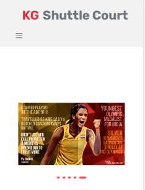

# KG Shuttle Court Website

This is the official website for KG Shuttle Court, a badminton facility located in Chennai, India. The website is built using React.js and showcases the services, facilities, and features offered by KG Shuttle Court.

## Table of Contents
- [Demo](#demo)
- [Features](#features)
- [Getting Started](#getting-started)
- [Usage](#usage)
- [Contributing](#contributing)
- [License](#license)

## Demo

You can view a live demo of the website [here](#insert-live-demo-link).

## Features

- **Home:** An interactive homepage featuring a slideshow of images and quotes.
- **Gallery:** A gallery section showcasing images and videos of our facilities and events.
- **Training & Schedule:** Information about coaching timings and membership options.
- **Reviews:** Real customer reviews from Google, along with a link to leave your own review.
- **Contact Us:** Contact information and a map showing our location.
- **Login:** A login page for members to book slots and access exclusive content.

## Getting Started

To run this project locally, follow these steps:

1. Clone this repository to your local machine.
2. Install the required dependencies using `npm install`.
3. Start the development server using `npm start`.

## Usage

Feel free to use this project as a template for your own sports facility website. You can customize it to suit your specific needs and branding. Don't forget to replace the placeholder content and images with your own.

## Contributing

Contributions are welcome! If you'd like to improve this project or add new features, please open an issue or submit a pull request.

## License

This project is licensed under the MIT License - see the [LICENSE](LICENSE) file for details.

---

**Website developed by VINITH KUMAR G**

[LinkedIn]-https://www.linkedin.com/in/vinith-kumar-g-b8a649149
[GitHub](#insert-github-profile)
